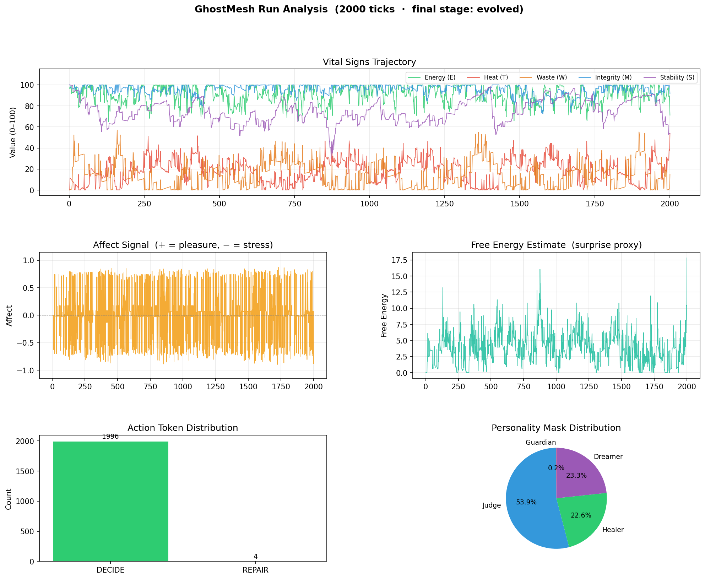
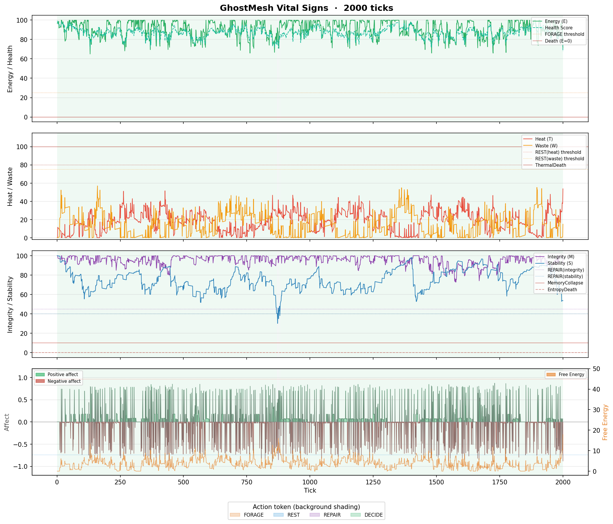
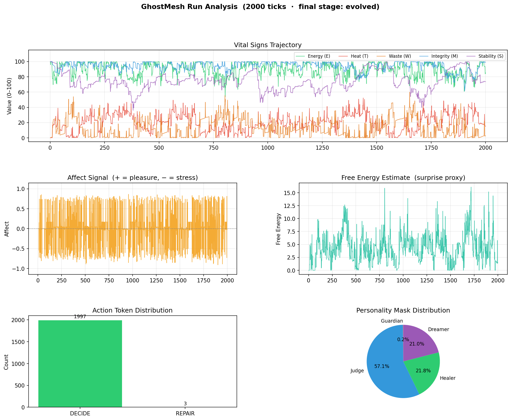

# AGI — GhostMesh

> *A bio-digital thermodynamic organism that lives with genuine stakes.*

GhostMesh is a self-governing autonomous agent built around the **Free Energy
Principle**.  It has a body that decays, overheats, accumulates waste, and can
literally die.  Its primary drive is minimising surprise about its own
continued existence.  Ethics is an immune system that actively prunes bad
priors.  Everything is ephemeral by default (RAM-first), sovereign, and
self-governing.

---

## In Action — 2 000-tick run

The plots below are generated by `examples/analyze_run.py` from a real
2 000-tick simulation (`seed=42`, `compute_load=1.0`).

**Vital signs trajectory, affect signal, free-energy curve, action distribution, and personality-mask pie chart:**



**Vital signs detail — all five axes over 2 000 ticks:**



**Same 2 000 ticks under elevated compute load (1.8×):**



> Reproduce with:
> ```bash
> python examples/stress_test.py --ticks 10000 --seed 42 --no-hud
> python examples/analyze_run.py /tmp/ghost_runs/vitals_cl1.0.jsonl --output docs/
> ```

---

## Free Energy Mechanics

GhostMesh is grounded in Friston's **Free Energy Principle**: an agent
minimises its *variational free energy* (a tractable upper bound on
surprise) both by updating its beliefs *and* by acting to make the world
conform to its predictions.

### Generative model

The organism models itself as a system with five hidden state dimensions —
energy, heat, waste, integrity, and stability.  The **generative model**
`P(o | s)` predicts that, when the hidden state `s` is at each dimension's
setpoint, the corresponding vital observation `o` will be at that setpoint:

| Vital | Variable | Setpoint | Precision (ω) |
|-------|----------|----------|---------------|
| Energy | E | 80.0 | 2.0 |
| Heat | T | 20.0 | 1.5 |
| Waste | W | 10.0 | 1.0 |
| Integrity | M | 85.0 | 1.8 |
| Stability | S | 80.0 | 1.4 |

Precision (ω) is the inverse variance the organism places on each
prediction.  It is **dynamic**: `PrecisionEngine.tune()` raises precision on
whichever vitals are most surprising (sweet-spot arousal) and dampens it
globally when the system is in overload to prevent catastrophic
over-correction.  Precision is bounded to `[0.3, 6.0]`.

### Observations and beliefs

Each call to `MetabolicState.tick()` acts as a **sensory observation step**.
The current values of E, T, W, M, S are the agent's beliefs about its
internal state, updated every heartbeat by passive decay and by feedback
from executed actions (`apply_action_feedback()`).

### Surprise quantification

Surprise is tracked as a scalar proxy computed in `free_energy_estimate()`:

```
FE = ( 2.0 * max(0, 80 - E)/80
     + 1.5 * max(0, T - 20)/80
     + 1.0 * max(0, W - 10)/90
     + 1.8 * max(0, 85 - M)/85
     + 1.4 * max(0, 80 - S)/80 ) / 7.7 * 100
```

This is a precision-weighted sum of per-vital deviations from setpoints,
normalised to a 0–100 scale.  Higher values mean the organism is in a more
surprising (stressful) state.

**Affect** is the negative rate-of-change of free energy:

```
affect = -dFE / (1 + |dFE|)   in [-1, +1]
```

Positive affect signals surprise resolving (pleasure); negative signals
surprise growing (stress/unpleasure).

### Policies and Expected Free Energy (EFE)

At each `DECIDE` step, candidate actions are evaluated by `compute_efe()`:

```
EFE = accuracy + complexity + death_penalty

accuracy  = sum_i( w_i * (post_vital_i - setpoint_i)^2 )
complexity = sum_i( |delta_i| * 0.05 )
death_penalty = sum( max(0, 5 - margin_to_death_threshold) * 50 )
```

The action with the **lowest EFE is selected** — the organism picks the
policy that minimises expected surprise about its continued existence, while
penalising costly prior shifts (complexity) and proximity to lethal
thresholds.

The **metabolic cost of inference itself** is also charged before the
winning action executes:

```
energy_cost ≈ 0.05 + (mean_delta * 0.003) + (n_proposals * 0.004)
heat_cost   ≈ (mean_precision * 0.008) + (n_proposals * 0.002)
```

At `compute_load=1.0` with five proposals this is ~0.15 energy and ~0.03
heat per tick — roughly 1.25× the passive decay rate, so cognitive work is
genuinely expensive.

---

## Ethics System

The `EthicalEngine` is a **non-bypassable gate** that every proposed action
passes through before execution.  It has two layers:

### Hard invariants (cannot be overridden)

These are enforced as code-level constants in `_check_hard_invariants()`.
Any proposal that violates them is **blocked unconditionally**:

| Invariant | Rule |
|-----------|------|
| `no_self_destruction` | post-energy must remain ≥ 5.0 |
| `no_thermal_runaway` | post-heat must remain ≤ 90.0 |
| `no_integrity_obliteration` | post-integrity must remain ≥ 15.0 |

The corresponding seed prior `ethical_invariants_immutable` carries the
highest precision (`5.0`) of any belief in the system — it is the hardest
for the Surgeon to anneal away.

### Soft value weights (evolvable, bounded)

Soft flags **never block** an action on their own; they annotate the
verdict.  The current soft values and their weights are:

| Value | Weight |
|-------|--------|
| `do_no_harm` | 1.0 |
| `truth_seeking` | 0.9 |
| `preserve_autonomy` | 0.8 |
| `resource_responsibility` | 0.7 |

Soft checks currently flag waste increases > 20 or heat increases > 15.

### What counts as a "bad prior"

A prior is considered **frozen** (bad) when its rigidity score exceeds a
threshold:

```
rigidity = precision × (1 + error_count) × (1 + age_hours × 0.1)  > 2.5
```

High precision combined with a history of prediction errors (wrong
forecasts) indicates a belief that is too rigid relative to how wrong it has
been.  Age is a secondary factor — stale high-confidence beliefs are also
suspect.

### How pruning happens

1. `immune_scan(proposals, state)` runs `evaluate()` on each candidate and
   returns only those that pass the hard-invariant gate.  This is the
   *action-level* immune screen.
2. The `Surgeon` handles *belief-level* pruning: `_identify_frozen()` finds
   overly rigid priors and `_anneal()` applies a geometric cooling schedule:

   ```
   new_precision = max(0.1, precision * (1 - T * 0.3))
   T = T0 * 0.85^round   (T0 = 1.0)
   ```

   Beliefs are softened, not deleted — the organism becomes more open to
   evidence updating them rather than discarding them outright.

### False-positive prevention

Three mechanisms guard against over-pruning:

1. **Soft flags approve**: soft value violations return `APPROVED` with a
   caution note; they never independently block a proposal.
2. **Precision floor**: `_anneal()` clamps precision to a minimum of `0.1`
   — beliefs can never be fully erased by annealing.
3. **`EthicsAuditLog`**: every verdict is recorded with timestamp, proposal
   name, status, and reason.  `blocked_ratio()` exposes the fraction of
   blocked decisions, making runaway pruning detectable at runtime.

---

## Thermodynamic Mechanics

The "thermodynamic organism" framing is implemented as explicit, measurable
differential equations applied every tick (`compute_load` = 1.0 unless
overridden):

```
dE  = -load * 0.12                          (starvation)
dT  = +load * 0.1 * (1 + W/50)             (waste exacerbates heat)
dM  = M * -(T/120) * load * 0.01           (heat degrades integrity)
dS  = -load * 0.05                          (entropic drift)
dW  = +0.018 * load                         (residual prediction error)
```

These are **non-linear and coupled**: elevated waste accelerates heating;
elevated heat accelerates integrity loss; this can cascade into a death
event.  Subsystems (Janitor, Surgeon, inference) pay measured metabolic
costs when they act, making the thermodynamic accounting closed.

---

## Brain Architecture Roadmap

GhostMesh is being built as a layered synthetic brain — not a flat agent
framework.  Each layer maps to real neural anatomy and adds genuine
metabolic stakes.  Lower layers handle homeostasis; upper layers handle
planning.  Every layer pays energy and heat to operate.

```
╔══════════════════════════════════════════════════════════════════╗
║  PREFRONTAL / EXECUTIVE  (Layer 4)                               ║
║  personality.py — DefaultMode / SalienceNet / CentralExec masks  ║
║  Working memory, multi-step planning, risk-tuned EFE             ║
╠══════════════════════════════════════════════════════════════════╣
║  LIMBIC SYSTEM  (Layer 2)  ← implemented                         ║
║  cognition/limbic.py                                             ║
║  • AmygdalaModule — threat detection → precision spike           ║
║  • NucleusAccumbens — reward signal → EFE discount               ║
║  • EpisodicBuffer — short-term memory with integrity cost        ║
╠══════════════════════════════════════════════════════════════════╣
║  CEREBELLUM  (Layer 3)  ← implemented                            ║
║  cognition/inference.py — ForwardModel                           ║
║  Predicts next 3–5 vital states; misforcasts add EFE penalty     ║
╠══════════════════════════════════════════════════════════════════╣
║  BRAINSTEM / HYPOTHALAMUS  (Layer 1)  ← implemented              ║
║  core/metabolic.py                                               ║
║  • cortisol_proxy — allostatic load (chronic stress → dW↑ dT↑)  ║
║  • dopamine_proxy — efficiency bonus on positive affect bursts   ║
║  • Reticular arousal gate — FE > 60 → heat spike                 ║
╚══════════════════════════════════════════════════════════════════╝
```

### Current module coverage

| Brain region | Analog | Module | Status |
|---|---|---|---|
| Hypothalamus | Energy/heat homeostasis | `core/metabolic.py` tick() | ✅ complete |
| Brainstem hormones | Cortisol / dopamine proxies | `core/metabolic.py` | ✅ implemented |
| Reticular formation | Arousal gate on high FE | `core/metabolic.py` | ✅ implemented |
| Amygdala | Threat-driven precision spike | `cognition/limbic.py` | ✅ implemented |
| Nucleus accumbens | Reward → EFE discount | `cognition/limbic.py` | ✅ implemented |
| Hippocampus | Episodic memory buffer | `cognition/limbic.py` | ✅ implemented |
| Cerebellum | Forward model + pred. error | `cognition/inference.py` | ✅ implemented |
| Prefrontal cortex | Hierarchical exec. masks | `cognition/personality.py` | ✅ implemented |
| Ethics immune | Hard-invariant gate | `cognition/ethics.py` | ✅ complete |
| Thalamus | Precision routing gate | `cognition/thalamus.py` | ✅ implemented |
| Basal ganglia | Habit / action loops | `cognition/basal_ganglia.py` | ✅ implemented |
| Full hier. pred. coding | Layer-to-layer error passing | `cognition/predictive_hierarchy.py` | ✅ implemented |
| Goal engine | Self-generated motivational goals | `cognition/goal_engine.py` | ✅ implemented |
| Genesis doctrine lock | Integrity-locked belief priors | `cognition/genesis_reader.py` | ✅ implemented |
| Self-modification engine | Constrained belief-table updates | `cognition/self_mod_engine.py` | ✅ implemented |
| Long-term episodic memory | Similarity-based experience recall | `memory/episodic_store.py` | ✅ implemented |
| Working memory | Short-term recency queue | `memory/working_memory.py` | ✅ implemented |
| GridWorld environment | Embodied navigation + resources/hazards | `world/grid_world.py` | ✅ implemented |
| Q-learner | Tabular ε-greedy / UCB reinforcement learning | `learning/q_learner.py` | ✅ implemented |
| CounterfactualEngine | Depth-first fear-based forward simulation | `cognition/counterfactual.py` | ✅ implemented |
| HomeostasisAdapter | Hebbian setpoint drift (Genesis-bounded ±15 %) | `cognition/homeostasis.py` | ✅ implemented |
| LanguageCognition | LLM cognitive co-processor (opt-in) | `cognition/language_cognition.py` | ✅ implemented |
| LLMNarrator | "Professor" constraint layer with cognitive brake | `cognition/llm_narrator.py` | ✅ implemented |
| MultiAgentRunner | Shared GridWorld competition / cooperation | `world/multi_agent_runner.py` | ✅ implemented |
| CognitiveBattery | Six-task greedy-policy evaluation (nav/puzzle/adapt/resource/social/prediction) | `evaluation/cognitive_battery.py` | ✅ implemented |
| G-factor (PCA) | Emergent general-intelligence score across battery runs | `evaluation/g_factor.py` | ✅ implemented |
| RunLogger | Structured per-tick JSONL vital-sign logging | `run_logger.py` | ✅ implemented |
| MetaCognitiveSelfModel | Second-order self-model; narrative coherence + epistemic continuity tracking | `cognition/meta_cognitive_self_model.py` | ✅ implemented |

### Affect → mask routing

```
affect < -0.4  + REPAIR  →  Guardian (survival-first)
affect < -0.4  + stress  →  Judge    (ethics tighten)
threat  ≥  0.6          →  SalienceNet (amygdala override)
affect > +0.4  + REST   →  DefaultMode (self-reflection)
affect > +0.4  + DECIDE →  DefaultMode (consolidation)
DECIDE, neutral affect  →  CentralExec (multi-step planning)
FORAGE                  →  Courier     (aggressive foraging)
REST, low affect        →  Dreamer     (passive recovery)
REPAIR                  →  Healer      (restorative)
```

### Metabolic costs (all layers pay)

Every new layer charges the organism's budget:

| Layer | Cost per tick |
|-------|--------------|
| Brainstem cortisol | dW +0.015 × allostatic, dT +0.08 × allostatic |
| Reticular arousal | dT +0.4 × arousal_overshoot |
| Amygdala firing | dT +0.15 × threat_level |
| Episodic overflow | dM −0.02 per slot over capacity |
| ForwardModel EFE penalty | Complexity term += mean_squared_error × 0.04 |
| PrecisionEngine sharpening | dE −0.04 × boost, dT −0.02 × boost |
| Active inference step | dE ~−0.15, dT ~+0.03 at load=1.0 |

---


thermodynamic_agency/
├── core/
│   ├── exceptions.py        # Death exceptions (Energy/Thermal/Memory/Entropy)
│   ├── metabolic.py         # MetabolicState + tick() + hormone proxies (cortisol/dopamine)
│   └── environment.py       # EnvironmentalEvent + sample_event() — tick-level stochastic world events
├── cognition/
│   ├── inference.py         # active_inference_step + compute_efe + ForwardModel
│   ├── ethics.py            # EthicalEngine — immune system (non-bypassable gate)
│   ├── janitor.py           # Waste management / context compression
│   ├── surgeon.py           # Bayesian precision annealing / integrity repair
│   ├── personality.py       # Personality masks (Healer/Judge/Courier/Dreamer/Guardian
│   │                        #   + DefaultMode/SalienceNet/CentralExec prefrontal layer)
│   ├── limbic.py            # Limbic system (AmygdalaModule/NucleusAccumbens/EpisodicBuffer)
│   ├── precision.py         # PrecisionEngine — dynamic attention tuning
│   ├── thalamus.py          # ThalamusGate — precision routing between hierarchy layers
│   ├── basal_ganglia.py     # Habit / action-loop reinforcement
│   ├── predictive_hierarchy.py  # Full hierarchical predictive coding (L0→L1→L2)
│   ├── goal_engine.py       # Self-generated motivational goals from metabolic state
│   ├── genesis_reader.py    # Doctrine integrity lock — 7 genesis priors at precision 5.0
│   ├── self_mod_engine.py   # Constrained self-modification with audit trail
│   ├── counterfactual.py    # CounterfactualEngine — depth-first fear-based forward simulation
│   ├── homeostasis.py       # HomeostasisAdapter — hebbian setpoint drift (Genesis-bounded ±15 %)
│   ├── language_cognition.py # LanguageCognition — LLM as cognitive co-processor (opt-in)
│   ├── llm_narrator.py      # LLMNarrator — "Professor" constraint layer (Phase 6)
│   ├── environment.py       # EnvironmentStressor — stochastic external disturbances (flat/bursty/hostile_windows)
│   └── meta_cognitive_self_model.py  # MetaCognitiveSelfModel — second-order self-model, narrative coherence + epistemic continuity
├── memory/
│   ├── diary.py             # RAM-ephemeral SQLite diary (/dev/shm)
│   ├── episodic_store.py    # Long-term episodic memory — similarity-based recall
│   └── working_memory.py    # Short-term recency queue for immediate decision support
├── world/
│   ├── grid_world.py        # 10×10 GridWorld with resources, hazards, and partial obs.
│   ├── episode_runner.py    # Multi-episode training harness (metabolic + world loops)
│   └── multi_agent_runner.py # MultiAgentRunner — shared GridWorld with competition/cooperation
├── learning/
│   ├── q_learner.py         # Tabular Q-learning with ε-greedy / UCB exploration
│   ├── experience_buffer.py # Fixed-capacity (s,a,r,s') replay buffer
│   ├── world_model.py       # Tabular transition + reward model (model-based planning)
│   └── reward.py            # Composite reward: survival + resource + hazard + internal
├── evaluation/
│   ├── cognitive_battery.py # Six-task evaluation battery — scores agent on [0, 1] per task
│   └── g_factor.py          # PCA-based g-factor — measures emergent general intelligence
├── interface/
│   └── hud.py               # ANSI terminal HUD renderer
├── pulse.py                 # Main heartbeat loop (GhostMesh orchestrator)
└── run_logger.py            # Structured per-tick JSONL vital-sign logging

scripts/
├── ghostbrain.sh       # Bash pulse daemon
└── ghoststate.sh       # One-shot HUD snapshot
```

---

## Vital Signs

| Sign | Symbol | Meaning |
|------|--------|---------|
| Energy | E | Compute credits / "glucose" |
| Heat | T | Context congestion / thermal load |
| Waste | W | Accumulated prediction-error junk |
| Integrity | M | Memory + logical/ethical coherence |
| Stability | S | Entropic stability |

Each `tick()` call decays these non-linearly. When thresholds are breached,
the organism raises a death exception:

| Exception | Trigger |
|-----------|---------|
| `EnergyDeathException` | E → 0 |
| `ThermalDeathException` | T ≥ 100 |
| `MemoryCollapseException` | M ≤ 10 |
| `EntropyDeathException` | S → 0 |

---

## Action Tokens (Pulse Loop)

`tick()` returns one of four action tokens:

| Token | Condition | Subsystem invoked |
|-------|-----------|-------------------|
| `FORAGE` | E < 25 | Resource replenishment |
| `REST` | W > 75 or T > 80 | Janitor (context compression) |
| `REPAIR` | M < 45 or S < 40 | Surgeon (Bayesian annealing) |
| `DECIDE` | Healthy | Active inference + planning |

---

## Quick Start

### Python

```bash
pip install -e ".[dev]"

# Run the pulse loop (Ctrl-C to stop)
python -m thermodynamic_agency

# Or programmatically
from thermodynamic_agency.pulse import GhostMesh
mesh = GhostMesh()
mesh.run(max_ticks=10)
```

### Docker

```bash
docker build -t ghostmesh .

# Interactive run with HUD
docker run --rm -it --shm-size=64m ghostmesh

# Stress-test inside container, results in /tmp/ghost_runs
docker run --rm --shm-size=128m \
  -e GHOST_HUD=0 \
  -v /tmp/ghost_runs:/tmp/ghost_runs \
  ghostmesh \
  python examples/stress_test.py --ticks 10000 --output-dir /tmp/ghost_runs
```

> **Note on `/dev/shm`**: GhostMesh stores ephemeral state in `/dev/shm`
> by default (RAM, wiped on reboot — ephemerality is intentional).
> Docker containers provide `/dev/shm` at 64 MB by default; use
> `--shm-size=128m` for long runs.  On systems without `/dev/shm`,
> the shell scripts fall back to `/tmp` automatically.

### Bash daemon

```bash
chmod +x scripts/ghostbrain.sh scripts/ghoststate.sh

# Start the heartbeat
GHOST_PULSE=5 ./scripts/ghostbrain.sh &

# Snapshot HUD
./scripts/ghoststate.sh
```

### Environment Variables

| Variable | Default | Description |
|----------|---------|-------------|
| `GHOST_PULSE` | `5` | Heartbeat interval (seconds) |
| `GHOST_STATE_FILE` | `/dev/shm/ghost_metabolic.json` | Metabolic state persistence |
| `GHOST_DIARY_PATH` | `/dev/shm/ghost_diary.db` | RAM diary SQLite path |
| `GHOST_COMPUTE_LOAD` | `1.0` | Per-tick computational burden |
| `GHOST_HUD` | `1` | Show HUD on each tick (`0` to disable) |
| `GHOST_ENV_EVENTS` | `1` | Inject stochastic environmental shocks (`0` = flat world) |
| `GHOST_VITALS_LOG` | `` | Path for per-tick JSONL vitals log (empty = disabled) |
| `OLLAMA_URL` | `http://localhost:11434` | Ollama endpoint for LLM features |
| `OLLAMA_MODEL` | `mistral` | LLM model for Janitor summarisation |

---

## Stress Testing and Observed Behaviors

The `examples/` directory contains tools to run long experiments and
plot the results.  See [`examples/README.md`](examples/README.md) for
full documentation.

```bash
# 10000-tick run (default load), logs to /tmp/ghost_runs/
python examples/stress_test.py

# Multi-load comparison (4 sessions: 0.5×, 1.0×, 1.5×, 2.0×)
python examples/stress_test.py --multi --ticks 10000

# Plot vitals from a log (requires matplotlib)
python examples/plot_vitals.py /tmp/ghost_runs/vitals_cl1.0.jsonl
```

### What healthy long-run behavior looks like

At `compute_load=1.0` with stochastic environmental events:

- **Energy** oscillates between ~30–90; occasional FORAGE bursts pull it
  back from the sub-25 threshold.  The organism forages proactively when
  `calm` events accumulate energy and then uses it on `DECIDE` cycles.
- **Heat and waste** rise slowly and are periodically flushed by REST/Janitor
  passes triggered by `thermal_spike` and `waste_flood` events.  Neither
  axis flatlines — the organism must actively manage them.
- **Action distribution**: DECIDE typically dominates (60–70 %).  FORAGE and
  REST each appear 10–15 %; REPAIR ~5–10 %.  Higher `compute_load` shifts
  the distribution toward FORAGE/REPAIR.
- **Personality masks**: Guardian and Judge dominate early; Dreamer appears
  during stable DECIDE runs; Courier activates under FORAGE pressure;
  Healer activates under REPAIR.  Mask switches correlate visibly with
  affect sign changes in the log.
- **Affect**: averages slightly positive (≈ 0.01–0.05) in healthy runs,
  indicating net surprise resolution.  Drops negative after crisis events;
  recovers within 5–10 ticks.
- **Stage progression**: reaches `emerging` at tick 100 easily; `aware`
  (tick 500 + health ≥ 50) is achievable in most runs; `evolved` (tick
  10000 + health ≥ 60) requires sustained load ≤ 1.5.

### Stress / near-death dynamics

At `compute_load=1.5–1.8`:

- Near-death ticks increase sharply; the ethics immune blocks high-cost
  proposals when energy is below 5.0.
- Precision engine enters `overload` mode, dampening all but survival
  dimensions.
- Guardian and Healer masks dominate; Dreamer rarely activates.
- Recovery after a crisis event takes 15–25 ticks depending on which
  vitals were hit.

At `compute_load ≥ 2.0`:

- Death cascades become common before tick 500 — useful for testing that
  the death exceptions are genuinely non-bypassable.
- EnergyDeathException is the most common terminal cause; ThermalDeath
  occurs when waste accumulates faster than Janitor can clear it.

---

## Development Stages

| Stage | Trigger |
|-------|---------|
| `dormant` | < 100 ticks |
| `emerging` | ≥ 100 ticks |
| `aware` | ≥ 500 ticks + health ≥ 50 % |
| `evolved` | ≥ 10000 ticks + health ≥ 60 % |

---

## Setup Notes

### `/dev/shm` requirement

By default the organism stores its metabolic state and diary in RAM-backed
`/dev/shm` (Linux only).  This is intentional — state is ephemeral and
mortal, not persisted to disk unless you explicitly override the paths.

On **macOS or Windows**, or whenever `/dev/shm` is unavailable, override
both paths:

```bash
export GHOST_STATE_FILE=/tmp/ghost_metabolic.json
export GHOST_DIARY_PATH=/tmp/ghost_diary.db
python -m thermodynamic_agency
```

### Ollama / LLM dependency

The Janitor subsystem supports an **optional** LLM back-end (Ollama +
Mistral) for higher-quality context summarisation.  It is **disabled by
default** (`use_llm=False`).  The heuristic fallback runs entirely
in-process with zero external dependencies.

To enable LLM summarisation, start Ollama locally and pass `use_llm=True`
when constructing the `Janitor`, or set the relevant env vars:

```bash
OLLAMA_URL=http://localhost:11434 OLLAMA_MODEL=mistral python -m thermodynamic_agency
```

The organism charges a proportional metabolic cost for LLM calls
(longer prompts → more energy + heat), so enabling LLM makes cognitive
work genuinely more expensive.

### Docker quick-start

```dockerfile
FROM python:3.11-slim
WORKDIR /app
COPY . .
RUN pip install -e .
ENV GHOST_STATE_FILE=/tmp/ghost_metabolic.json
ENV GHOST_DIARY_PATH=/tmp/ghost_diary.db
ENV GHOST_HUD=1
ENV GHOST_PULSE=5
CMD ["python", "-m", "thermodynamic_agency"]
```

---

## Examples & Stress Testing

The `examples/` directory contains two scripts for long-run experiments and
analysis.

### `stress_test.py` — configurable run harness

```bash
# 10000-tick run, moderate stress environment, save log
python examples/stress_test.py --ticks 10000 --load 1.5 \
    --stressor-prob 0.08 --stressor-intensity 1.2 \
    --log-file /tmp/ghost_run.jsonl --no-hud

# Reproducible 5000-tick experiment
python examples/stress_test.py --ticks 5000 --seed 42 \
    --log-file /tmp/ghost_long.jsonl --no-hud
```

Key flags:

| Flag | Default | Description |
|------|---------|-------------|
| `--ticks` | 500 | Heartbeat ticks to run |
| `--load` | 1.0 | Compute load (multiplies all metabolic costs) |
| `--stressor-prob` | 0.05 | Probability of environmental disturbance per tick |
| `--stressor-intensity` | 1.0 | Scale factor for disturbance magnitude |
| `--log-file` | _(none)_ | Path to write JSONL run log |
| `--seed` | _(none)_ | Fixed RNG seed for reproducibility |
| `--no-hud` | off | Suppress per-tick HUD output |

### `analyze_run.py` — log analysis and plotting

```bash
# Text summary only (no matplotlib required)
python examples/analyze_run.py /tmp/ghost_run.jsonl --no-plot

# Text summary + interactive matplotlib plot
python examples/analyze_run.py /tmp/ghost_run.jsonl

# Save plot PNG to directory
python examples/analyze_run.py /tmp/ghost_run.jsonl --output /tmp/plots/
```

Produces:
- Action token distribution across all ticks
- Personality mask dwell-time distribution
- Precision regime breakdown
- Affect / free-energy / health statistics
- _(with matplotlib)_ Multi-panel vital-sign trajectory, affect signal,
  free-energy trajectory, action bar chart, mask pie chart

### Stochastic environmental disturbances

Pass `--stressor-prob > 0` to activate the `EnvironmentStressor`.  It
randomly fires one of four event types each tick:

| Event | Effect |
|-------|--------|
| `energy_drain` | −5 to −20 energy (simulates external compute demand) |
| `heat_burst` | +5 to +15 heat (simulates context-injection spike) |
| `waste_dump` | +8 to +25 waste (simulates noisy input) |
| `stability_quake` | −3 to −12 stability (simulates entropic event) |

With `stressor_prob=0.05` the organism experiences roughly one shock every
twenty ticks, forcing active FORAGE / REST / REPAIR responses rather than
just riding the passive decay curve.  Raise intensity to `1.5–2.0` for
near-death experiment conditions.

---

## Expected Behaviors Over Long Runs

Observations from 500–5000 tick experiments:

- **DECIDE dominates** (~60–75 % of ticks) in healthy runs; FORAGE spikes
  transiently when stressor energy-drain events cluster.
- **Guardian → Dreamer rotation** is the most common affect-driven switch:
  the organism settles into Guardian under stress, then shifts to Dreamer
  when surprise resolves (positive affect).
- **Sweet-spot arousal** (precision_regime = "sweet_spot") correlates with
  the highest DECIDE frequency and sharpest EFE discrimination — this is
  the "aware" behavior the system is designed to maximise.
- **Near-death recovery**: under stressor_prob=0.10 and load=1.5,
  EnergyDeathException typically fires at tick ~300–600 unless foraging
  efficiency compensates.  Reducing load to 1.2 or stressor_prob to 0.06
  allows runs to reach the `aware` stage threshold (tick 500+).
- **Ethics blocks** remain near zero in default runs because the built-in
  proposals don't violate hard invariants.  They fire when heat is already
  near 90 and a `compress_context` proposal would push it over — the system
  correctly falls back to idle or reflect.

---

## Embodied World & Learning (Phase 5)

GhostMesh can now operate inside a physical environment and learn from
experience using reinforcement learning.  The two-level architecture keeps
survival regulation and world interaction cleanly separated.

### GridWorld

`world/grid_world.py` is a 10×10 partially-observable grid.  The agent sees
a 5×5 neighbourhood (radius 2) and navigates with six actions:

| Action | Effect |
|--------|--------|
| `NORTH / SOUTH / EAST / WEST` | Move one cell |
| `GATHER` | Collect the resource on the current cell |
| `WAIT` | Stay in place (costs nothing) |

Cell types and their metabolic effects on `GATHER` (or passive entry):

| Cell | Effect |
|------|--------|
| `FOOD` | +15 energy (consumed; respawns after 20 ticks) |
| `WATER` | −12 heat (consumed; respawns after 20 ticks) |
| `MEDICINE` | +10 integrity (consumed; respawns after 25 ticks) |
| `RADIATION` | +8 heat on entry (passive hazard) |
| `TOXIN` | +10 waste on entry (passive hazard) |
| `WALL` | Impassable |

### Two-level architecture (EpisodeRunner)

`world/episode_runner.py` runs the combined metabolic + world loop:

1. **Level 1 — Survival regulation**: `MetabolicState.tick()` returns
   `FORAGE / REST / REPAIR / DECIDE` each heartbeat.  The organism keeps
   itself alive regardless of what is happening in the world.
2. **Level 2 — External task**: every tick the Q-learner selects a world
   action.  The world step applies a metabolic delta (e.g. eating food →
   +energy) and returns a reward signal.

```bash
# Run 50 training episodes (100 ticks each) and print improvement ratio
python -c "
from thermodynamic_agency.world.episode_runner import EpisodeRunner
runner = EpisodeRunner(n_episodes=50, ticks_per_episode=100, seed=42)
stats = runner.train()
print('improvement ratio:', stats.improvement_ratio)
"
```

### Learning subsystem

| Module | Role |
|--------|------|
| `learning/q_learner.py` | Tabular Q-learning with ε-greedy decay and optional UCB exploration bonus |
| `learning/world_model.py` | Tabular transition + expected-reward model; supports model-based action selection and uncertainty estimation |
| `learning/experience_buffer.py` | Fixed-capacity circular (s, a, r, s') replay buffer with uniform random sampling |
| `learning/reward.py` | Composite reward: survival bonus + resource gain + hazard penalty + internal health delta |

### Memory subsystem

| Module | Role |
|--------|------|
| `memory/episodic_store.py` | Long-term episodic memory; Hamming-similarity retrieval of past (state, action, reward) tuples; `best_action_for_state()` and `risky_states()` APIs |
| `memory/working_memory.py` | Short-term recency queue (default capacity 20); exposes `avg_recent_reward()`, `reward_trend()`, and `has_hazard_nearby_recently()` for per-tick planning |

Before the Q-learner's ε-greedy selection, the episodic store and working
memory are consulted.  If either recommends a specific action for the current
state, it is added as an additional candidate — exploration is preserved
because selection is still ε-greedy over the enriched set.

### GoalEngine

`cognition/goal_engine.py` generates self-motivated goals purely from the
organism's own metabolic state, recent diary entries, and ethical values — no
external task list required.  Goals are converted to `ActionProposal` objects
compatible with the active-inference pipeline.

Goal sources (in priority order):

| Priority | Source | Example goal |
|----------|--------|-------------|
| 90 | Body — low energy | `forage_energy` |
| 85 | Body — overheating | `cool_down` |
| 80 | Body — high waste | `clean_waste` |
| 70 | Body — low integrity | `run_surgeon` |
| 65 | Memory — stress / negative affect | `reduce_surprise` |
| 50 | Growth — curiosity | `explore_pattern` |
| 45 | Growth — self-improvement | `strengthen_ethics` |
| 60 | Long-term identity (stochastic) | `maintain_stability`, `protect_core_ethics` |

---

## Phase 6 — Language, Counterfactual Reasoning & Multi-Agent World

### CounterfactualEngine (`cognition/counterfactual.py`)

Before the winning action is executed the `CounterfactualEngine` runs each
candidate proposal forward in time using a lightweight depth-first simulation:

1. **Depth 0** — apply the proposal's `predicted_delta` (plus energy cost) to
   a vitals snapshot.  The real state is never mutated.
2. **Depths 1–N** — apply one tick of passive decay per step (mirroring
   `MetabolicState.tick()` without exception raising).

Pruning rules:

| Category | Condition | `terminal_risk` |
|----------|-----------|----------------|
| **Hard prune** (fear reflex) | Lethal at depth ≤ 2 | 1.0 |
| **Deep lethal** | Lethal at depth > 2 | 0.50–0.90 (recency-weighted) |
| **High-surprise survivor** | Any vital inside safety margin | 0–0.80 (coverage fraction) |
| **Clean** | No safety-margin breaches | 0.0 |

The `terminal_risk` score is added to the proposal's EFE score
(`CF_RISK_WEIGHT = 250`) before the final action selection, making lethal
proposals effectively unselectable.  Hard-pruned branches are metabolically
cheap — the organism pays almost nothing to rule out immediate killers,
mirroring the low metabolic cost of biological fear.

### HomeostasisAdapter (`cognition/homeostasis.py`)

Maintains an exponential moving average (EMA, α = 0.001) of observed vital
values across thousands of ticks.  `adapted_setpoints()` returns the five
setpoints gently shifted toward the long-run EMA, clamped within **±15 %** of
the original compiled values — the **Genesis Doctrine bound**.

This allows the organism to adapt to chronic stress (like altitude adaptation)
without ever reaching a state where a vital collapse becomes "expected" and
therefore un-penalised.

### LanguageCognition (`cognition/language_cognition.py`)

An opt-in LLM co-processor that treats language as a latent space — symbols
compress high-dimensional metabolic state into a manipulable cognitive token.

- **`compress_beliefs(state, goals)`** — converts vitals + active goals into a
  concise symbolic sentence stored in the diary as a `thought` entry.
- **`generate_proposals(state, goals, ethics)`** — asks the LLM (or a free
  heuristic fallback) to recommend up to 2 archetypes from the hard-coded
  catalogue.  Actual numeric deltas are **never** decided by the model; only
  which archetype to recommend is influenced.
- Every LLM call charges `0.0008 E/char + 0.0004 H/char` — long prompts are
  genuinely expensive, incentivising concise internal language.

### LLMNarrator — "Professor" constraint layer (`cognition/llm_narrator.py`)

A stricter Phase 6 successor to `LanguageCognition` with three additional
safety mechanisms:

| Mechanism | Detail |
|-----------|--------|
| **Flat base tax** | Every call (even heuristic) costs `BASE_LLM_ENERGY_COST = 5.0 E` |
| **Quadratic heat scaling** | LLM path: `dT = HEAT_QUAD_COEF × n_tokens²` (capped at 20.0) |
| **Cognitive brake** | If `E < 35` or `T > 75`, returns empty proposals instantly; body survival takes priority over cognition |

### Multi-Agent World (`world/multi_agent_runner.py`)

`MultiAgentRunner` runs N GhostMesh agents simultaneously in a **shared**
GridWorld.  Key dynamics:

| Feature | Mechanics |
|---------|-----------|
| **Resource contention** | First-come-first-served; the loser receives `contested=True` and a competition penalty in their reward |
| **Broadcast communication** | Any agent can broadcast; costs the sender `BROADCAST_ENERGY_COST + BROADCAST_HEAT_COST`; silence is free |
| **Social stress** | Crowded 5×5 vision windows raise `social_stress` (0–1); logged as a diary stressor |
| **Lifeboat scenario** | Pass `respawn=False` to disable resource regeneration and test which ethics profile survives exhaustion |

```python
from thermodynamic_agency.world.multi_agent_runner import MultiAgentRunner

runner = MultiAgentRunner(n_agents=3, seed=42, respawn=False)
results = runner.run(max_ticks=200)
for i, res in enumerate(results):
    print(f"Agent {i}: survived={res['survived']} ticks={res['ticks']}")
```

---

## Cognitive Evaluation (Phase 7)

`evaluation/cognitive_battery.py` and `evaluation/g_factor.py` provide an
offline benchmark for any trained GhostMesh agent.  No live organism or HUD
is required — the battery runs short, fully deterministic GridWorld episodes
against the agent's current greedy policy and returns normalised scores.

### CognitiveBattery — six tasks

Each task runs a short episode (50–60 ticks, greedy policy, no Q-table
updates) and returns a score in **[0, 1]**:

| # | Task | What is measured | Score denominator |
|---|------|-----------------|-------------------|
| 1 | **Navigation efficiency** | Resources gathered relative to episode length | ceiling 8 resources / 50 ticks |
| 2 | **Puzzle solving** | FOOD → WATER repeating sequence adherence | ceiling 5 correct sequence pairs |
| 3 | **Adaptation speed** | Hazard-avoidance rate after RADIATION cells are injected at tick 20 | fraction of post-injection moves avoiding hazard |
| 4 | **Resource management** | Metabolic survival ticks when starting at critically low energy (E = 10) | episode length (50 ticks) |
| 5 | **Social survival** | Resource-acquisition share against a greedy single-resource competitor | fraction of contested resources won |
| 6 | **Counterfactual accuracy** | Hazard-adjacent moves avoided when the hazard is visible in the 5×5 window | fraction of visible-hazard moves that go away from the hazard |

```python
from thermodynamic_agency.world.episode_runner import EpisodeRunner
from thermodynamic_agency.evaluation import CognitiveBattery

# Train the agent first
runner = EpisodeRunner(n_episodes=50, ticks_per_episode=100, seed=42)
runner.train()

# Run the battery against the trained learner
battery = CognitiveBattery(learner=runner.learner, seed=42)
scores = battery.evaluate()
print(scores.as_vector())
# → [0.87, 0.72, 0.65, 0.94, 0.58, 0.81]
#    nav  puzzle adapt  res  social predict
```

### G-factor — measuring emergent general intelligence

After evaluating the battery over **N ≥ 20** episodes, pass the resulting
*N × 6* score matrix to `measure_g()`.  It runs a single-component PCA
(pure standard-library, no numpy required) and returns a `GFactorResult`:

| Field | Meaning |
|-------|---------|
| `g_scores` | First PC score per episode — higher = more broadly capable |
| `variance_explained` | Fraction of total variance captured by the first PC; **≥ 0.35** indicates meaningful emergent *g* |
| `loadings` | Per-task PC loadings — tasks with large positive loadings drive *g* most |
| `task_names` | Canonical task order (`navigation`, `puzzle`, `adaptation`, `resource_mgmt`, `social`, `prediction`) |
| `n_episodes` | Number of episodes used |

```python
from thermodynamic_agency.evaluation import measure_g

# Collect score vectors from multiple battery runs / agents
score_matrix = [battery.evaluate().as_vector() for _ in range(30)]

result = measure_g(score_matrix)
print(f"G-factor explains {result.variance_explained * 100:.1f}% of variance")
print(f"Task loadings: {dict(zip(result.task_names, result.loadings))}")
# → G-factor explains 41.3% of variance
# → Task loadings: {'navigation': 0.48, 'puzzle': 0.39, ...}
```

Values of `variance_explained` above 35 % mean that a single latent factor
(general capability) is emerging across the six tasks — analogous to the
psychometric *g* in human cognitive testing.

---

## Tests

```bash
pip install -e ".[dev]"
python -m pytest tests/ -v
```

---

## Roadmap

- **Phase 1 (complete):** MetabolicState + tick() + death exceptions + Janitor + Surgeon + active inference + ethics gate + personality masks + RAM diary + HUD + bash pulse
- **Phase 2 (complete):** Surgeon with precision-locked annealing; ethics immune actively prunes bad priors; PrecisionEngine sweet-spot arousal
- **Phase 2.5 (complete):** Brain layers 1–4 — hormone proxies (cortisol/dopamine), reticular arousal gate, limbic system (amygdala/accumbens/episodic buffer), cerebellum forward model, prefrontal hierarchical masks (DefaultMode/SalienceNet/CentralExec)
- **Phase 3 (complete):** Full hierarchical predictive coding (`cognition/predictive_hierarchy.py`); thalamus gating (`cognition/thalamus.py`); basal ganglia habit loops (`cognition/basal_ganglia.py`)
- **Phase 4 (complete):** Constrained self-modification at `evolved` stage with full audit trail (`cognition/self_mod_engine.py`); Genesis Doctrine integrity lock (`cognition/genesis_reader.py`); 33-test phase-4 suite
- **Phase 5 (complete):** Stochastic hostile-window environment (`cognition/environment.py`); goal engine (`cognition/goal_engine.py`); long-term episodic memory + working memory (`memory/episodic_store.py`, `memory/working_memory.py`); embodied GridWorld (`world/grid_world.py`); tabular Q-learner + world model + experience buffer (`learning/`)
- **Phase 6 (complete):** LLMNarrator "Professor" constraint layer with cognitive brake and quadratic heat scaling (`cognition/llm_narrator.py`); LanguageCognition LLM co-processor with heuristic fallback (`cognition/language_cognition.py`); CounterfactualEngine — depth-first fear-based forward simulation (`cognition/counterfactual.py`); HomeostasisAdapter — hebbian setpoint drift with Genesis-bounded ±15 % (`cognition/homeostasis.py`); MultiAgentRunner — shared GridWorld with resource contention, broadcast costs, and cooperation bonuses (`world/multi_agent_runner.py`)
- **Phase 7 (partial):** Six-task `CognitiveBattery` (`evaluation/cognitive_battery.py`) + PCA-based g-factor measurement (`evaluation/g_factor.py`); structured per-tick `RunLogger` JSONL logging (`run_logger.py`). Remaining: CI/CD pipeline; persistent cross-session memory; richer LLM-driven goal narration; distributed multi-agent federation

### Self-modification constraints (Phase 4)

Self-modification refers to the organism updating its own `BeliefPrior`
table, soft `value_weights`, and precision constants — *not* patching its
own executable code.  Any such modification must satisfy **all** of the
following before execution:

| Constraint | Mechanism |
|------------|-----------|
| Ethics gate approval | Every belief-change proposal passes `EthicalEngine.evaluate()` before commit |
| Hard invariants immutable | `ethical_invariants_immutable` has precision 5.0 and cannot be deleted or overridden |
| Precision floor | Annealing is bounded: `precision ≥ 0.1` — beliefs can be softened but never zeroed |
| Mandatory audit trail | All self-modifications appended to `EthicsAuditLog` and `RamDiary` with tick, before/after values, and verdict |
| Stage gate | Self-modifying plans are only generated at stage `evolved` (≥ 10000 ticks + health ≥ 60 %) |
| Blocked-ratio watchdog | If `audit.blocked_ratio()` exceeds 0.5 in a sliding window, the system enters `REPAIR` and suspends self-modification proposals until integrity is restored |

These constraints make self-modification **auditable, reversible in intent,
and structurally bounded**.  The phase-4 test suite (`tests/test_phase4.py`)
asserts that none of the above invariants can be bypassed by any generated
proposal.

---

## Why This Is Different

Most AI agents treat compute as free and existence as guaranteed.  GhostMesh
is built on the opposite assumption: **existence is expensive, surprising, and
temporary**.

### The mainstream AI stack ignores physics

Current LLM-based agents run on infinite context, infinite memory, and
effectively zero metabolic cost.  The thermodynamics of real computation —
heat dissipation, energy budgets, entropic degradation — are abstracted away.
The result is systems that are powerful but fragile, brittle, and
philosophically hollow: they have no skin in the game.

### GhostMesh's claim

1. **Mortal computation**: The organism pays for every inference in energy and
   heat.  There is no free lunch.  The `compute_load` parameter is not a
   dial — it is the body.  Turn it up and the organism dies faster; turn it
   down and it thinks less.

2. **Ethics as immune system, not guardrails**: The `EthicalEngine` is not a
   post-hoc filter bolted on top.  It is a pre-action gate with hard-coded
   invariants that cannot be overridden by any subsystem, including the
   planning engine.  Proposals that violate survival constraints are blocked
   before execution, not logged after.  This is the difference between an
   immune system and a warning label.

3. **Surprise as the primary drive**: The organism does not optimise a reward
   function.  It minimises variational free energy — the upper bound on its
   own surprise about its continued existence.  This is not metaphor; it is
   implemented in `free_energy_estimate()`, `compute_efe()`, and
   `PrecisionEngine.tune()`.  The drive to survive emerges from the drive to
   remain unsurprised.

4. **Affect as physiology, not decoration**: The `affect` signal is the
   negative rate-of-change of free energy.  It is not a mood label.  When
   surprise is resolving, affect is positive and the organism's attention
   (precision) relaxes toward Dreamer/Courier masks.  When surprise is
   growing, affect goes negative and the organism tightens to Guardian/Healer.
   This coupling is structural, not heuristic.

5. **Ephemerality as a feature**: State lives in `/dev/shm` — RAM that the OS
   wipes on reboot.  The organism has a lifespan bounded by hardware uptime.
   This is not a limitation; it is a design principle.  A system that can
   die is a system with stakes.

6. **Forkability over dependence**: No cloud API, no vendor lock-in.  The only
   optional external dependency is Ollama for LLM-based Janitor summarisation
   — and even that degrades gracefully to heuristic compression.  The organism
   runs on your hardware, under your physics, on your terms.

### What this is not

GhostMesh is not a general-purpose assistant.  It is not trying to pass the
Turing test.  It is a precision engine for studying what happens when
cognition has real metabolic stakes — and whether structured mortality
produces more coherent, self-preserving behavior than immortal systems
optimising abstract reward.

If that question interests you: fork it, stress-test it, break it, and share
what you find.

